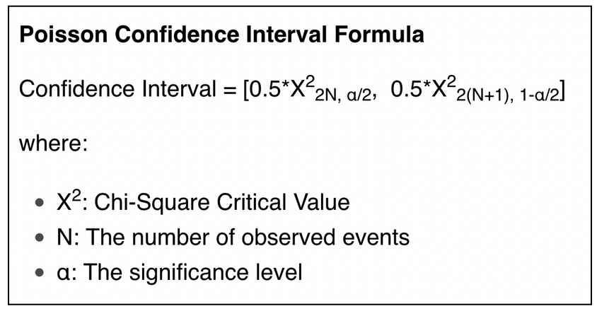

# Welcome to the Herschlag lab's wrapper for DREEM

This repo is a wrapper for [Joe Yesselman's DREEM module](https://github.com/jyesselm/dreem), that implements the DREEM algorithm developed by the Rouskin lab.

The wrapper allows the user to run DREEM on different samples and to add standardized experimental details to DREEM output. 

## Requirements

DREEM package must be in your environment.
You need RNAstructure installed to run RNAstructure, otherwise deactivate this option in the config file.

## Installation

dreem_herschlag is available on PyPi:

```
pip install dreem_herschlag
```

You can also clone this repo and run make:

```
cd [PATH_TO_WHERE_YOU_WANT_THE_REPO]
git clone https://github.com/yvesmartindestaillades/dreem_herschlag
cd dreem_herschlag
make init
```

## Test your installation

### Setup RNAstructure (optional) 
If you want to use RNAstructure, open `test/test_config.yml` and assign `dreem_args/RNAstructure_path` to your path the `RNAstructure/exe`.

### Run

```
cd PATH/TO/REPO
dreem_herschlag --config test/test_config.yml
```

You should get this output:
```
$ dreem_herschlag --config test/test_config.yml
dreem_herschlag --config test/test_config.yml
Checking files
Checking test/resources/samples.csv
Checking samples.csv done

Checking case_1/library.csv
Ignored sequence, not in library_attributes
Checking case_1/library.csv done

Checking files done

Running DREEM
dreem -fq1 test/resources/case_1/r1.fastq -fq2 test/resources/case_1/r2.fastq -fa test/resources/case_1/ref.fasta --sample case_1 --sample_info temp/samples.csv --library_info temp/case_1/library.csv --overwrite 
[19:27 bit_vector.py run] INFO ran at commandline as: 
[19:27 bit_vector.py run] INFO /Users/ymdt/src/dreem_herschlag/bin/dreem -fq1 test/resources/case_1/r1.fastq -fq2 test/resources/case_1/r2.fastq -fa test/resources/case_1/ref.fasta --sample case_1 --sample_info temp/samples.csv --library_info temp/case_1/library.csv --overwrite
[19:27 bit_vector.py validate_files] INFO fasta file: test/resources/case_1/ref.fasta exists
[19:27 bit_vector.py validate_files] INFO fastq file: test/resources/case_1/r1.fastq exists
[19:27 bit_vector.py validate_files] INFO fastq2 file: test/resources/case_1/r2.fastq exists
[19:27 bit_vector.py validate_files] INFO two fastq files supplied, thus assuming paired reads
[19:27 bit_vector.py get_parameters] INFO -o/--overwrite supplied, will overwrite previous results with same name
[19:27 bit_vector.py build_directories] INFO building directory structure
[19:27 mapper.py __init__] INFO bowtie2 2.4.5 detected!
[19:27 mapper.py __init__] INFO fastqc v0.11.9 detected!
[19:27 mapper.py __init__] INFO trim_galore 0.6.6 detected!
[19:27 mapper.py __init__] INFO cutapt 1.18 detected!
[19:27 mapper.py __run_command] INFO running fastqc
[19:27 mapper.py __run_command] INFO fastqc ran without errors
[19:27 mapper.py __run_command] INFO running trim_galore
[19:27 mapper.py __run_command] INFO trim_galore ran without errors
[19:27 mapper.py __run_command] INFO running bowtie2-build
[19:27 mapper.py __run_command] INFO bowtie2-build ran without errors
[19:27 mapper.py __run_command] INFO running bowtie2 alignment
[19:27 mapper.py __run_command] INFO bowtie2 alignment ran without errors
[19:27 mapper.py __run_bowtie_alignment] INFO results for bowtie alignment: 
2500 reads; of these:
  2500 (100.00%) were paired; of these:
    168 (6.72%) aligned concordantly 0 times
    2331 (93.24%) aligned concordantly exactly 1 time
    1 (0.04%) aligned concordantly >1 times
93.28% overall alignment rate
[19:27 mapper.py __run_picard_bam_convert] INFO Converting BAM file to SAM file format
[19:27 mapper.py __run_command] INFO running picard BAM conversion
[19:27 mapper.py __run_command] INFO picard BAM conversion ran without errors
[19:27 mapper.py __run_picard_sort] INFO sorting BAM file
[19:27 mapper.py __run_command] INFO running picard BAM sort
[19:27 mapper.py __run_command] INFO picard BAM sort ran without errors
[19:27 mapper.py run] INFO finished mapping!
[19:27 bit_vector.py run] INFO starting bitvector generation
[19:27 bit_vector.py __run_command] INFO running picard SAM convert
[19:27 bit_vector.py __run_command] INFO picard SAM convert ran without errors
[19:27 bit_vector.py run] INFO MUTATION SUMMARY:
| name          |   reads |   aligned |   no_mut |   1_mut |   2_mut |   3_mut |   3plus_mut |   sn |
|---------------|---------|-----------|----------|---------|---------|---------|-------------|------|
| mttr-6-alt-h3 |    2332 |     99.96 |    46.42 |   36.81 |   13.21 |    3.05 |        0.04 | 7.76 |

None
DREEM done

```

## Run DREEM

This part will help you run DREEM with ease for multiple samples.

### Organize your sequencing files
Your fasta/fastq files organization should look like this:

```
|- /[path_to_fastq_files]
     |- samples.csv
     |- library.csv
     |- [some name].fasta
     |- [your_sample_1]_R1_001.fastq.gz
     |- [your_sample_1]_R2_001.fastq.gz
     |- [your_sample_2]_R1_001.fastq.gz
     |- [your_sample_2]_R2_001.fastq.gz
     |- [your_sample_3]_R1_001.fastq.gz
     |- [your_sample_3]_R2_001.fastq.gz
     |- ...
```

We assume here that all smaples have the same fasta file and the same library. 
If you want to use different libraries, make several folders and run this module several times.`

### Fill in config.yml

- Download the `template_config.yml` template at the root of this repo, or generate it with ``dreem_herschlag --generate_templates``
- You may rename your file `my_config.yml` or whatever sounds good to you, so that you don't overwrite it.
- Open the file and follow the fill-in instructions.


### RUN!

```
dreem_herschlag --config my_config.yml
```


## Add info

This part will help you add additional content to your data:

- a library ``library.csv``, containing per-construct items.
- a library ``samples.csv``, containing per-sample items.
- various ``RNAstructure`` predictions, such as different structure and deltaG predictions and base-pairing probability.
- binomial confidence intervals using the ``Poisson`` distribution confidence interval.

Adding this content can be activated or deactivated in the config file.

### Write additional experimental information files

To add additional experimental information to DREEM's output, you have to create `samples.csv` and `library.csv` using the terminal.

__*TEMPLATES.CSV*__


Generate templates for `samples.csv`, `library.csv` and `my_config.yml` by running:

```
dreem_herschlag --generate_templates .
```

__*SAMPLES.CSV*__


`samples.csv` contains information about each sample as a whole, such as the temperature or the date. 
Each row of `samples.csv` correspond to a single sample. 
The `sample` column of `samples.csv` must match the `your_sample_#` folders names shown above.
`exp_env` column content MUST BE set to `in_vivo` or `in_vitro`.

Columns description for `samples.csv` can be found by typing:

```
dreem_herschlag --sample_info
```


__*LIBRARY.CSV*__


`library.csv` contains information about each construct in a sample.
There must be one `library.csv` file per sample.
The `name` column of `library.csv` should match the constructs name of the fasta file.

Columns description for `library.csv` can be found by typing:

```
dreem_herschlag --library_info
```

### RNAstructure predictions

[RNAstructure](https://rna.urmc.rochester.edu/RNAstructureWeb/) is a software from Prof. Mathews' lab. 
It predicts the structure of a RNA molecule and its thermodynamic energy based on Turner rules.

RNAstructure predicts the following:
- ``deltaG_min``, i.e the energy of the most thermodynamically stable structure w.r.t Turner's rules.
- ``structure``, i.e the most thermodynamically stable structure w.r.t Turner's rules.

You can add options in the config file to make addtional predictions:
- ``dms``, i.e RNAstructure uses the dms signal to predict the structure.  
- ``temperature``, i.e RNAstructure uses the temperature entered in ``samples.csv`` to predict the structure. 
- ``roi``, i.e RNAstructure makes predictions for the ROI defined in ``library.csv``.

The corresponding part in the config file is the following:

```
# RNAstructure options
# ---------------------
rnastructure:
    temperature: False           # Use samples.csv col 'temperature_k' as an input for RNAstructure
    suffix_fold_cmd: ''          # Additional input to add to the RNAstructure 'Fold' command      
    # for using DMS signal as an input in the argument 
    dms: True                    # Add predictions using DMS
    max_paired_mut_rate: 0.01    # below this value, 0% of the bases are unpaired
    min_unpaired_mut_rate: 0.05  # above this value, 100% of the bases are unpaired
    temperature: True            # Add predictions using temperature
    roi: True                    # Add predictions using the ROI if there's a roi
```

Output attributes are the following:

```
deltaG, deltaG_DMS, deltaG_DMS_ROI, deltaG_DMS_ROI_T, deltaG_DMS_T, deltaG_ROI, deltaG_ROI_T, deltaG_T, deltaG_ens, deltaG_ens_ROI_ROI, deltaG_ens_ROI_ROI_T,deltaG_ens_T,mut_probability,structure,structure_DMS,structure_DMS_ROI,structure_DMS_ROI_T,structure_DMS_T,structure_ROI,structure_ROI_T,structure_T
```

### Poisson confidence intervals

We want to get a confidence interval for each mutation rate of the population average.

**Method:**

For each residue of a sequence, we model the probability of mutation by a binomial law. 
We approximate this binomial law by a Poisson distribution ([Montgomery, 2001](https://www.statisticshowto.com/binomial-confidence-interval/)), and we use Poisson's confidence interval to compute a confidence interval for each residue of our population average.

The formula is the following:



A fully detailed document is available [here](https://docs.google.com/document/d/1g13esMA0uah9Hsl38r_5fLpSkWI4SrxCnZK4WgvkoCg/edit#heading=h.nxw03wabe0i2).

### RUN!

```
dreem_herschlag --config my_config.yml
```


## A few cool features

### Export to csv / json

Export your pickle files to a csv or a json format by editing ``to_CSV``  or ``to_JSON`` in the config file.

Thanks for reading. 
Please contact me at yves@martin.yt for any additional information or to contribute.

### Verbose mode

Set verbose to True to get more informations in your terminal.


